<div align="center">

# GitHub-Triggered CI/CD Pipeline on AWS
### *Pipeline as Code, end to end, from `git push` to a running server*

[](https://aws.amazon.com/codepipeline/)
[](https://aws.amazon.com/cloudformation/)
[](https://aws.amazon.com/codebuild/)
[](https://github.com/)
[](#-license)

**No manual deploys. No console clicking. Just `git push` and watch it happen.**

[Overview](#-overview) •
[Architecture](#-architecture) •
[Tools](#-tools--tech-stack) •
[Walkthrough](#-step-by-step-walkthrough) •
[What I Learned](#-what-this-project-taught-me) •
[Screenshots](#-screenshots)

</div>

---

## Overview

I built an automated system on AWS that sets up servers and deploys a website by itself - no manual button-clicking, no babysitting deployments. Every time I push code to GitHub, a fully automated pipeline takes over: it validates the infrastructure code, builds the project, and deploys or updates the servers behind an Auto Scaling Group.

This is Pipeline as Code in practice, the entire CI/CD flow, and the infrastructure it deploys, lives in version-controlled files (`buildspec.yml` + `template.yaml`), not in a UI someone has to remember how to click through.

> 💡 A great way to learn.

---

## Architecture

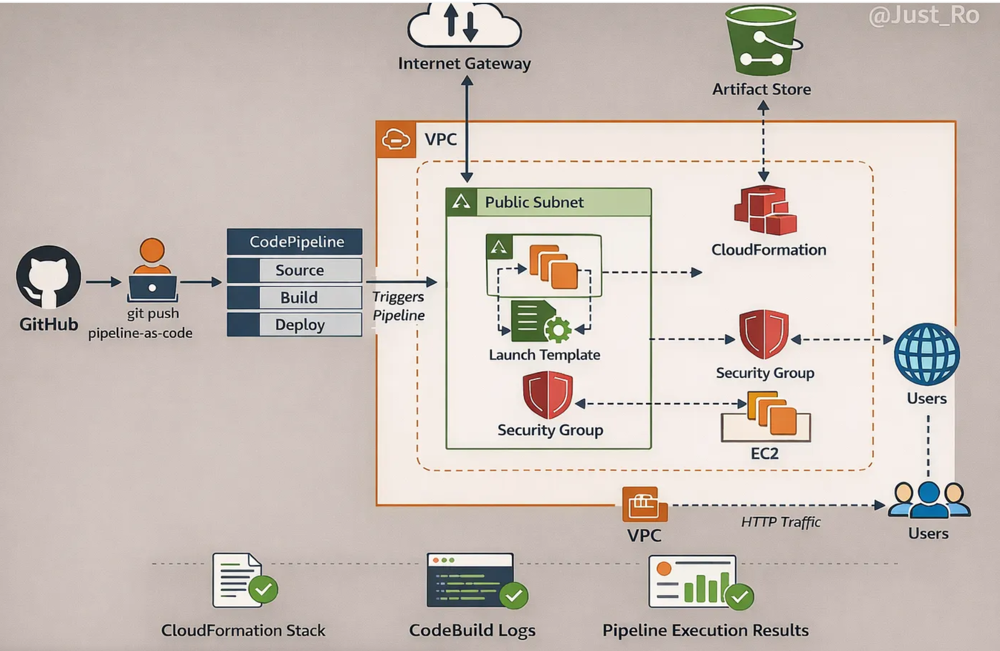

**The flow, in plain English:**

1.  I push code to GitHub
2.  CodePipeline notices the change (via webhook)
3.  CodeBuild prepares and validates the application
4.  CloudFormation creates or updates the servers
5.  Servers launch using a Launch Template
6.  An Auto Scaling Group takes over managing them

No manual intervention, anywhere in that chain.

---

## Tools & Tech Stack

| Tool | What it does here |
|---|---|
|  **AWS Console** | The control room - where all these services live and get wired together. |
|  **Pipeline-as-Code** | The whole build → deploy flow is written as code, not clicked together by hand. |
|  **GitHub** | Source of truth for the app code and the infrastructure definitions. |
|  **AWS CodePipeline** | Watches the repo and kicks off the automation the moment something changes. |
|  **AWS CodeBuild** | Builds and validates the code - think "checking homework before it's submitted." |
|  **AWS CloudFormation** | Turns YAML into real, running AWS resources. No manual provisioning. |
|  **Launch Template** | The blueprint for every EC2 instance the pipeline spins up. |
|  **Auto Scaling Group** | Adds or removes servers automatically as traffic changes. |

---

##  What This Project Taught Me

-  **Infrastructure as Code** - every resource is defined in code, nothing was clicked into existence by hand.
-  **Real automation** - once it's wired up, the system runs itself.
-  **CI/CD in practice** - code is tested and deployed automatically on every change.
-  **Reliable, repeatable deployments** - the same input produces the same result, every single time.

---

##  Project Structure

```
your-repo/
├── app/
│   └── index.html        # the website being deployed
├── buildspec.yml          # tells CodeBuild what to do
├── template.yaml           # CloudFormation blueprint for all AWS resources
└── README.md
```

---

##  Step-by-Step Walkthrough

### Set up your GitHub project

**Create the repository**

1. Head to [github.com](https://github.com) and log in.
2. Click **New Repository**.
3. Give it a name, choose **public** or **private**.
4. Click **Create Repository**.

**Add the core files**

<details>
<summary><code>app/index.html</code> - the site being deployed</summary>

```html
<!DOCTYPE html>
<html lang="en">
<head>
    <meta charset="UTF-8">
    <meta name="viewport" content="width=device-width, initial-scale=1.0">
    <title>My Simple WK7 Page</title>
    <style>
        body {
            font-family: Arial, sans-serif;
            text-align: center;
            margin-top: 50px;
            background-color: #f9f9f9;
        }
        h1 {
            color: #333;
        }
        p {
            color: #555;
        }
    </style>
</head>
<body>
    <h1>Welcome to My Challenge Website!</h1>
    <p>This is a simple HTML webpage for week 7(CI/CD) of the #AWS12WKChallenge.</p>
</body>
</html>
```

</details>

- **`template.yaml`** → tells AWS exactly what cloud resources to create.
- **`buildspec.yml`** → tells CodeBuild how to build and validate the project.

>  Put `index.html` inside a folder called `app/`.

---

**Set up CodeBuild with `buildspec.yml`**

`buildspec.yml` tells CodeBuild how to build and test the project automatically. It points at the CloudFormation template (`template.yaml`), which is created next.

```yaml
version: 0.2

phases:
  install:
    runtime-versions:
      python: 3.9
  build:
    commands:
      - echo "Build started"
      - aws cloudformation validate-template --template-body file://template.yaml

artifacts:
  files:
    - template.yaml
```

---

**Define the infrastructure with `template.yaml`**

This CloudFormation file sets up every cloud resource the project needs:

| Resource | Role |
|---|---|
|  **Security Group** | Controls who can reach your servers. |
|  **Launch Template** | Blueprint for starting EC2 servers with the right settings. |
|  **Auto Scaling Group** | Adds/removes servers automatically based on demand. |
|  **EC2 Instances** | The actual virtual machines running the app. |
|  **Rolling Update Policy** | Updates servers gradually, with zero downtime. |

<details>
<summary> Click to expand <code>template.yaml</code></summary>

```yaml
AWSTemplateFormatVersion: '2010-09-09'
Description: Week 7 - Pipeline-as-Code Infrastructure

Parameters:
  VpcId:
    Type: AWS::EC2::VPC::Id
    Description: VPC where EC2 resources will be deployed

  SubnetId:
    Type: AWS::EC2::Subnet::Id
    Description: Public subnet for Auto Scaling Group

Resources:
  WebSG:
    Type: AWS::EC2::SecurityGroup
    Properties:
      GroupDescription: Allow HTTP access
      VpcId: !Ref VpcId
      SecurityGroupIngress:
        - IpProtocol: tcp
          FromPort: 80
          ToPort: 80
          CidrIp: 0.0.0.0/0
      SecurityGroupEgress:
        - IpProtocol: -1
          CidrIp: 0.0.0.0/0

  LaunchTemplate:
    Type: AWS::EC2::LaunchTemplate
    Properties:
      LaunchTemplateData:
        ImageId: ami-0a3c3a20c09d6f377
        InstanceType: t2.micro
        NetworkInterfaces:
          - DeviceIndex: 0
            AssociatePublicIpAddress: true
            Groups:
              - !GetAtt WebSG.GroupId
        UserData:
          Fn::Base64: |
            #!/bin/bash
            yum update -y
            yum install -y httpd
            systemctl start httpd
            systemctl enable httpd
            echo "<h1>Deployed via CodePipeline</h1>" > /var/www/html/index.html

  AutoScalingGroup:
    Type: AWS::AutoScaling::AutoScalingGroup
    Properties:
      VPCZoneIdentifier:
        - !Ref SubnetId
      MinSize: '1'
      MaxSize: '2'
      DesiredCapacity: '1'
      LaunchTemplate:
        LaunchTemplateId: !Ref LaunchTemplate
        Version: !GetAtt LaunchTemplate.LatestVersionNumber
      HealthCheckType: EC2
      HealthCheckGracePeriod: 120
    UpdatePolicy:
      AutoScalingRollingUpdate:
        MinInstancesInService: 1
        MaxBatchSize: 1
        PauseTime: PT5M
        WaitOnResourceSignals: false

Outputs:
  SecurityGroupId:
    Description: Security Group ID
    Value: !GetAtt WebSG.GroupId

  LaunchTemplateId:
    Description: Launch Template ID
    Value: !Ref LaunchTemplate
```

</details>

---

### Set up a CodeBuild project

Open **CodeBuild** in the AWS Console.

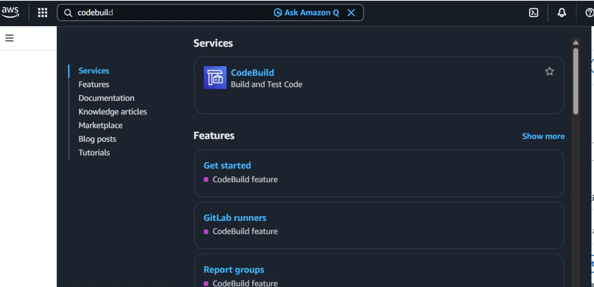

Click **Create build project**, then name it - this walkthrough uses `WK7-pipeline-as-code`.

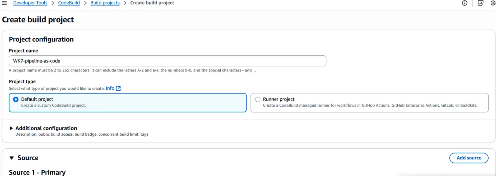

**Source**

Choose **GitHub** as the source provider. The account is connected through a Secrets Manager secret, and the repository is selected directly.

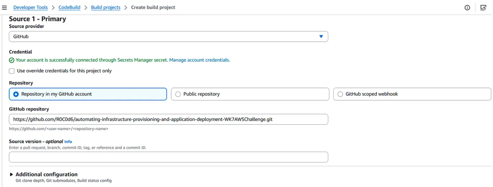

**Webhook**

With **"Rebuild every time a code change is pushed to this repository"** checked, every push automatically triggers a new build - no manual restarts needed. This section also sets the build type (**Single build**) and, for pull-request-based workflows, comment approval rules and approver roles.

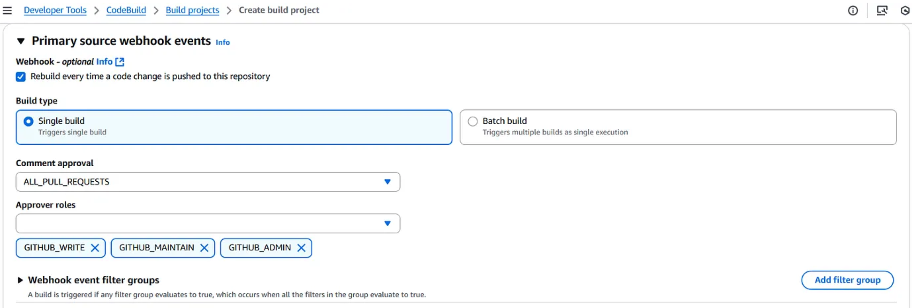

> ⚠️ **Heads up:** connecting GitHub requires a token or app authorization with the right scopes, including webhook access. Never commit real tokens or credentials to a repo - use a secrets manager or GitHub's encrypted secrets instead.

**Environment**

Use the **on-demand provisioning model** with a managed Amazon Linux image and standard runtime, on EC2 compute with container running mode.

In practice, this means AWS hands you a pre-configured, maintained Amazon Linux environment - no OS or runtime setup required - with the default tools needed for typical builds already in place.

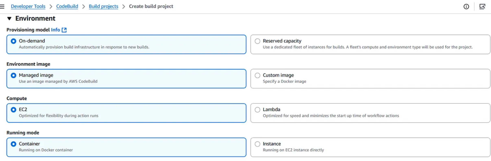

**Operating system, runtime, and service role**

The environment resolves to `aws/codebuild/amazonlinux-x86_64-standard:5.0`, always pinned to the latest image for that runtime. A **new service role** was created here (`codebuild-WK7-pipeline-as-code-service-role`), with the required inline policies attached afterward.

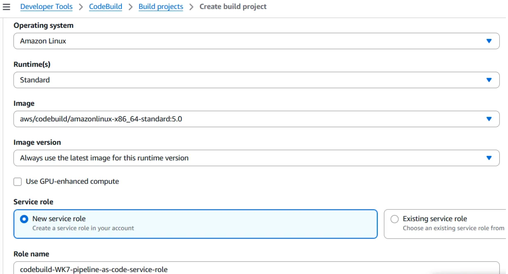

A service role is what lets CodeBuild act on your behalf - the attached policies define exactly what it's allowed to touch.

<details>
<summary> Example inline policy</summary>

```json
{
  "Version": "2012-10-17",
  "Statement": [
    {
      "Effect": "Allow",
      "Action": [
        "codepipeline:*",
        "codebuild:*",
        "codecommit:*",
        "codestar-connections:UseConnection"
      ],
      "Resource": "*"
    }
  ]
}
```

> **Note:** this policy is broad for demo purposes. In production, scope actions and resources down to exactly what's needed - avoid `*` wherever possible.

</details>

**Buildspec**

- Select **Use a buildspec file**
- Enter the name: `buildspec.yml`

This file defines everything CodeBuild runs - installing dependencies, validating the template, producing artifacts — so the build process stays automated and consistent every time.

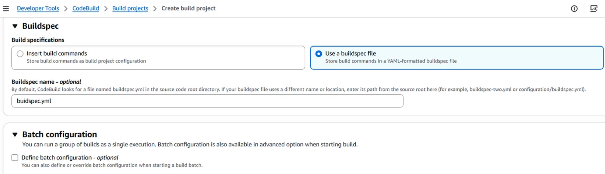

**Artifacts & logs**

Artifacts: **No artifacts** - this project validates infrastructure code rather than packaging a deployable build output. CloudWatch Logs are turned on (recommended - makes debugging much easier), grouped under `aws/codebuild/WK7-pipeline-as-code`.

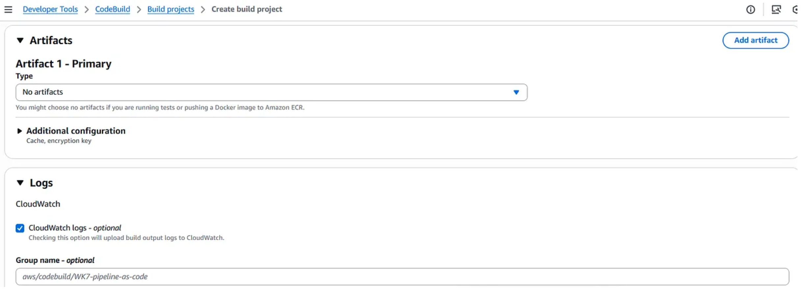

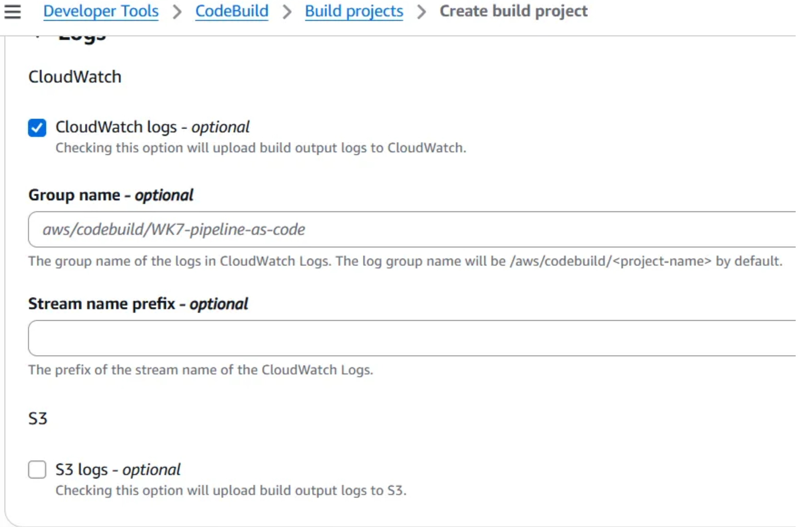

Click **Create build project** - and it's live.

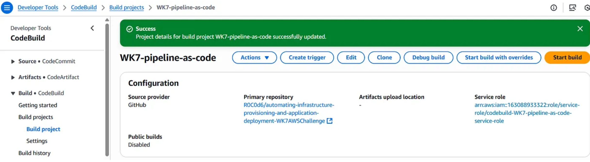

---

### Create the CodePipeline

In the AWS Console, go to **CodePipeline** → **Create pipeline**. This is where the source-to-deploy flow actually gets wired together.

Select **Build custom pipeline**.

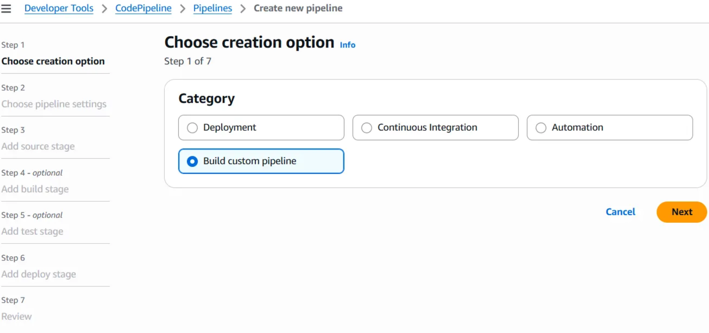

**Pipeline settings**

| Setting | Value |
|---|---|
| Name | `WK7-Pipeline` |
| Execution mode | Queued |
| Service role | Create a new role |

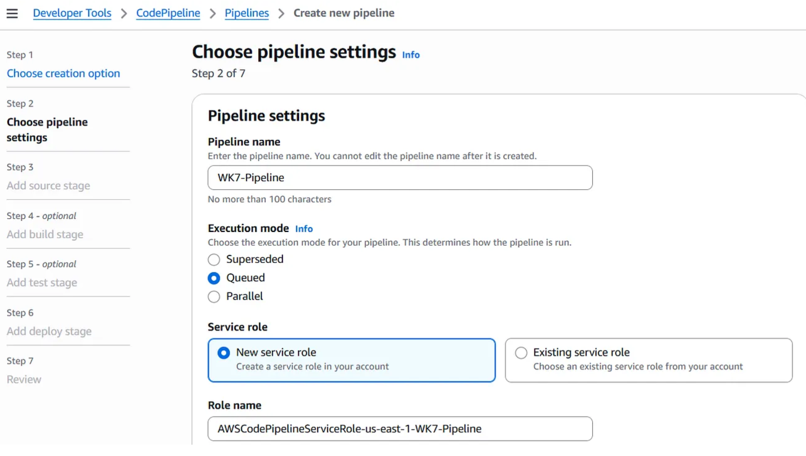

**Source settings**

| Setting | Value |
|---|---|
| Provider | GitHub (via GitHub App) |
| Repository & branch | Your repo and `main` branch |
| Connection | An existing CodeConnections connection, or a fresh **Connect to GitHub** |

The **service role** gives the pipeline permission to touch AWS resources. The **source stage** tells it where the code lives, down to the exact repo and default branch. Connecting through the GitHub App is what makes this feel magic - push to GitHub, and the pipeline just *goes*, with zero manual intervention.

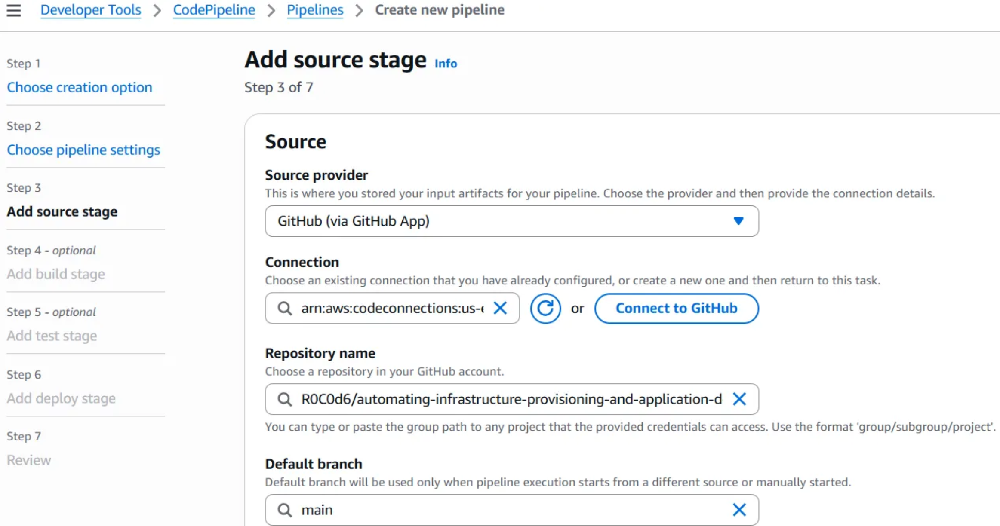

**Build stage**

- Provider: **Other build providers → AWS CodeBuild**
- Project: `WK7-pipeline-as-code`
- **Define buildspec override** checked → **Use a buildspec file** → `buildspec.yml`

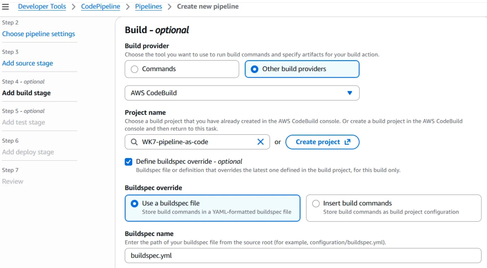

Further down: environment variables (none needed here), a **Single build** type, the target region, and **SourceArtifact** wired in as the input artifact - with automatic retry on stage failure enabled for resilience.

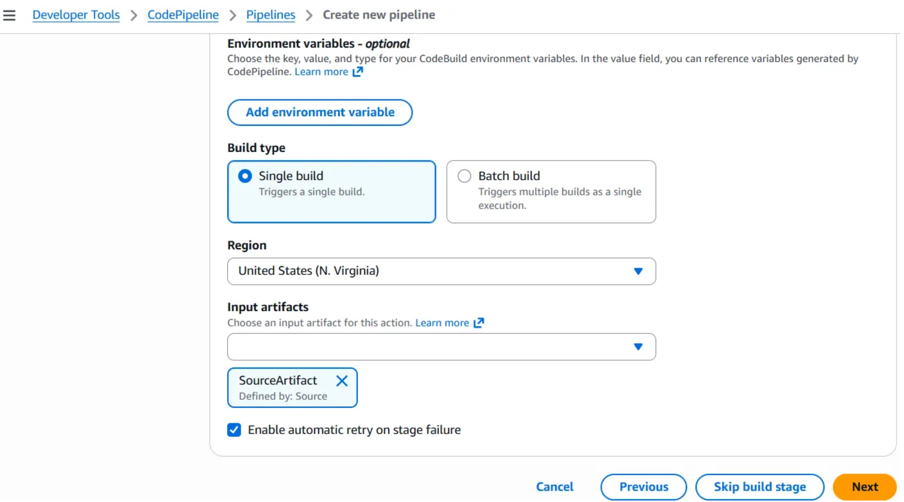

**Test stage** *(optional — skipped in this setup, but worth adding as the project grows)*

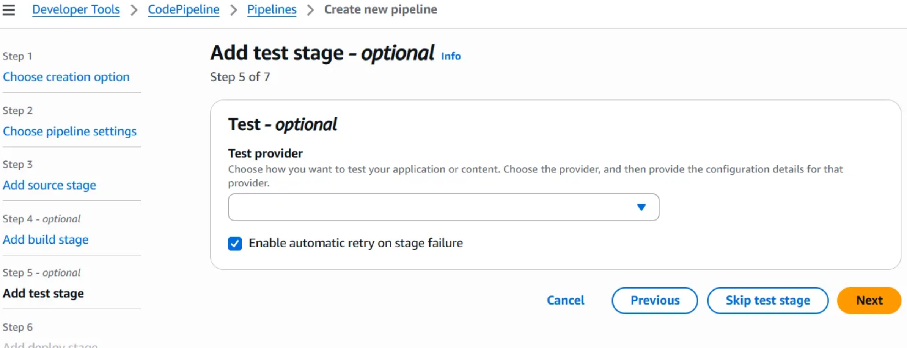

**Deploy stage**

| Setting | Value |
|---|---|
| Deploy provider | AWS CloudFormation |
| Region | United States (N. Virginia) |
| Input artifacts | BuildArtifact |
| Action mode | Create or update a stack |
| Stack name | Your chosen stack name |
| Template file | `template.yaml` |
| Parameter overrides | Your VPC ID and Subnet ID |
| Role name | A CloudFormation execution role (set up in IAM, with required inline policies attached) |

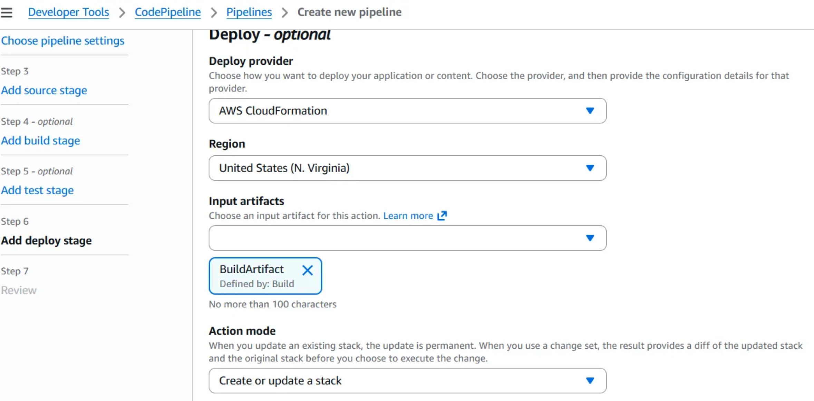

---

## The Result

From this point on, **every push to GitHub** does the following, automatically:

1.  **CodePipeline** retrieves the latest source code
2.  **CodeBuild** validates the CloudFormation template
3.  **CloudFormation** deploys the infrastructure

No manual steps - the pipeline handles the entire path from commit to running server.

When the template changes, CloudFormation updates the Auto Scaling Group and replaces instances **gradually, one at a time**, so there's no downtime along the way.

Here's the pipeline running end to end, straight from the console - Source, Build, and Deploy all green:

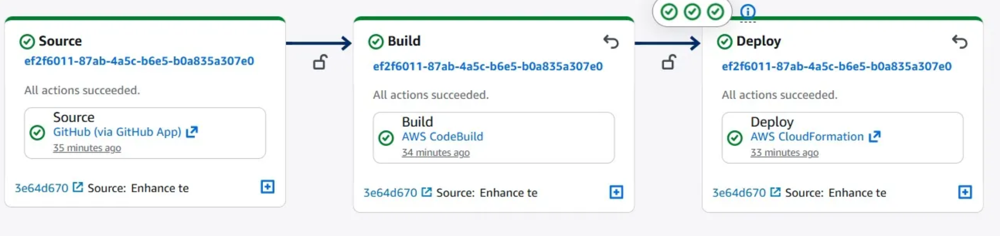

---

## Screenshots

<details>
<summary>Click to view the full walkthrough gallery</summary>

| | |
|---|---|
|  |  |
|  |  |
|  |  |
|  | |

</details>

---

## Possible Next Steps

- [ ] Add a **Test** stage with real unit/integration tests before deploy
- [ ] Move hardcoded parameters (VPC ID, Subnet ID) into **SSM Parameter Store**
- [ ] Tighten IAM policies from `*` to least-privilege scopes
- [ ] Add a manual approval gate before production deploys
- [ ] Front the Auto Scaling Group with an **Application Load Balancer**

---

## About the Author

**Roland Mawuli Awuku**
Cloud & security professional focused on building secure, scalable, production-ready systems on AWS.

[](https://medium.com/@awukurolandmawuli/building-a-github-triggered-ci-cd-pipeline-on-aws-using-codepipeline-pipeline-as-code-b44712afb102)

---

## License

This project is available under the [MIT License](LICENSE) - feel free to use it, learn from it, and adapt it for your own pipelines.

---

<div align="center">

** If this helped you understand AWS CI/CD, consider starring the repo!**
